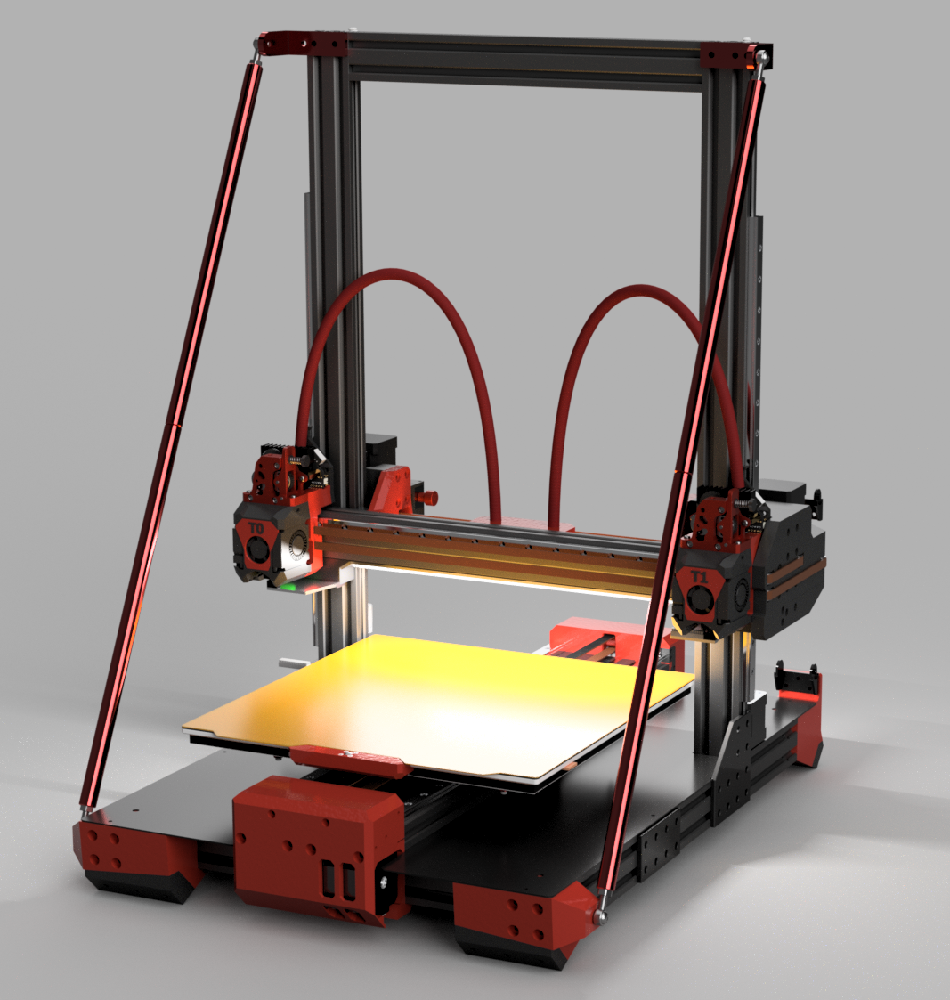
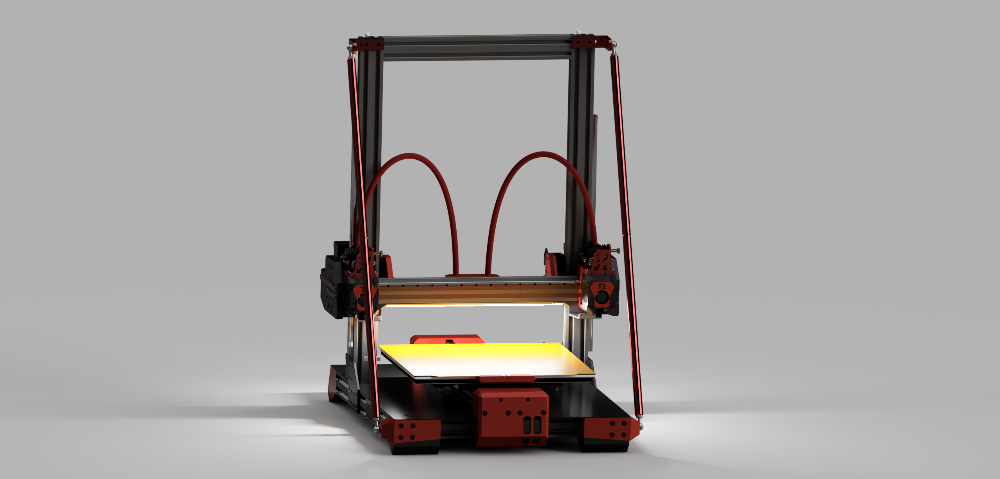

# Hellfire IDEX
Project page for my bedslinge IDEX 3d printer

After a long time of procrastination and spinning the cad model around i can finally state that the printer is done.... mostly.
The only non final part is the xy probe for toolhead alignment.

print volume:
 
dual toolhead use:  290mm x 310mm x 350mm

single toolhead use: 300mm x 310mm x 300mm

The original printer was a sidewinder x1, hence the new name paying homage to the printers roots.

Toolheads are based on Chirpy's Yavoth toolhead and further tweaked.
